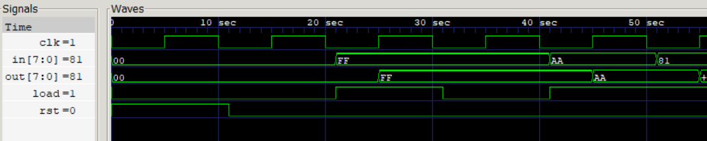

# Register
8-bit(Parameterized) loadable registers with asynchronous reset.

<p align="center">
  
  <br>
  <sub>Register load data at positive edge of clock </sub>
</p>

## Synthesis Results

**Technology:** Sky130 HD  
**Synthesis Tool:** Yosys

| Metric | Value |
|----------|----------|
| Area | 320.3072 µm² |

## Static Timing Analysis (OpenSTA)

### Scenario 1: Ideal Timing

Clock period constraint:

```text
10 ns
```

No input/output timing constraints applied.

| Metric | Value |
|----------|----------|
| Clock Period | 10 ns |
| Worst Slack | 9.28 ns |
| Estimated Critical Path | 0.72 ns |
| Estimated Fmax | ~1.38 GHz |

### Scenario 2: Constrained Timing

Timing constraints:

```text
Input Delay  = 1 ns
Output Delay = 1 ns
Clock Period = 10 ns
```

| Metric | Value |
|----------|----------|
| Clock Period | 10 ns |
| Worst Slack | 8.59 ns |
| Estimated Critical Path | 1.41 ns |
| Estimated Fmax | ~709 MHz |

## Timing Comparison

| Scenario | Worst Slack (ns) | Estimated Fmax |
|----------|----------:|----------:|
| Ideal STA | 9.28 | ~1.38 GHz |
| Constrained STA | 8.59 | ~709 MHz |

## Power Analysis

**Operating Frequency:** 100 MHz (10 ns clock period)

| Metric | Value |
|----------|----------|
| Total Power | 39.8 µW |
| Internal Power  | 38.5 µW   |
| Switching Power | 1.4 µW   |
| Leakage Power   | 0.138 nW |
